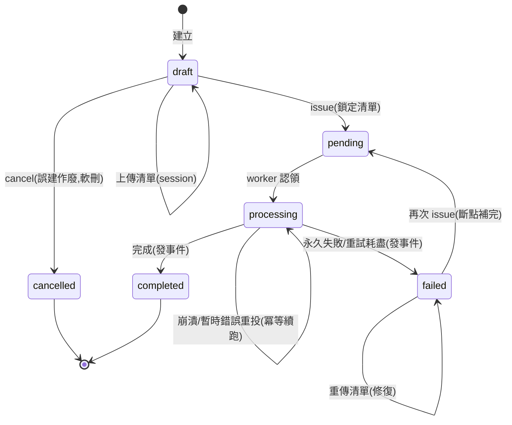
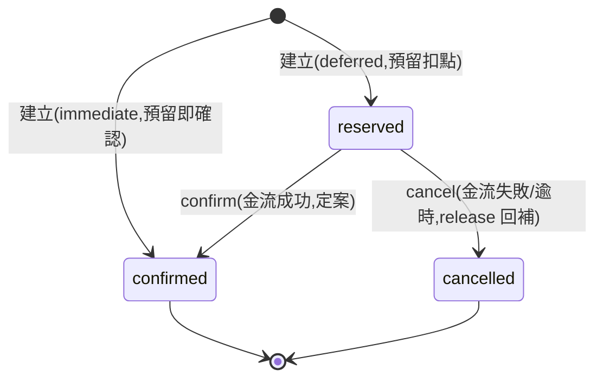
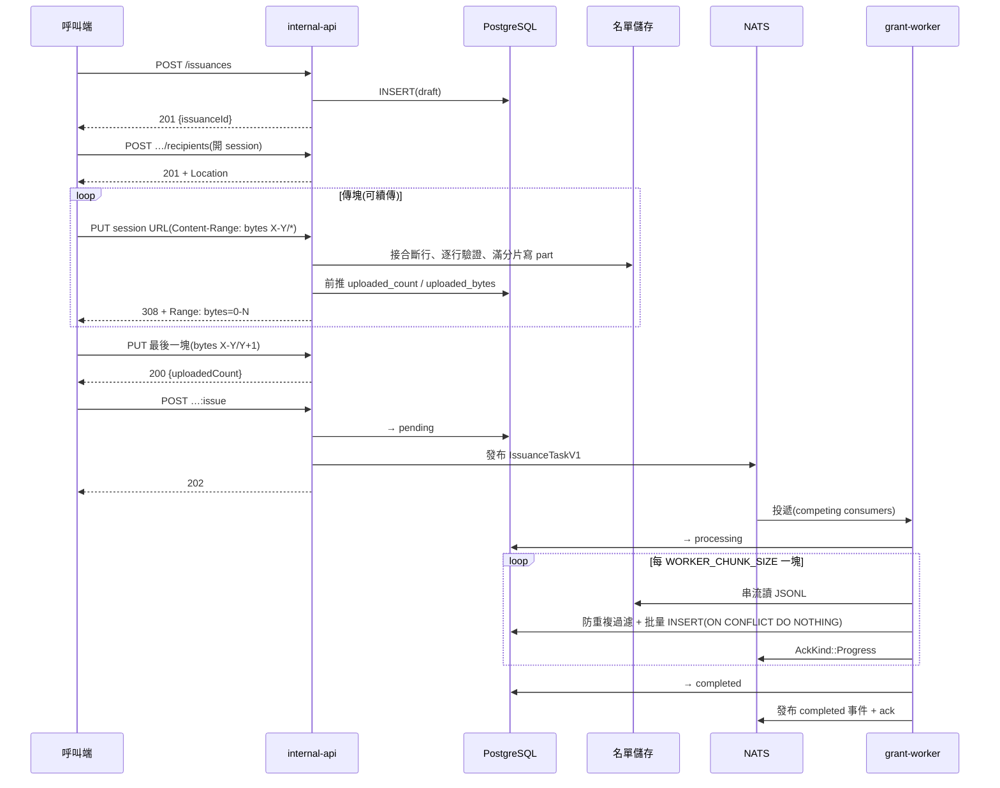
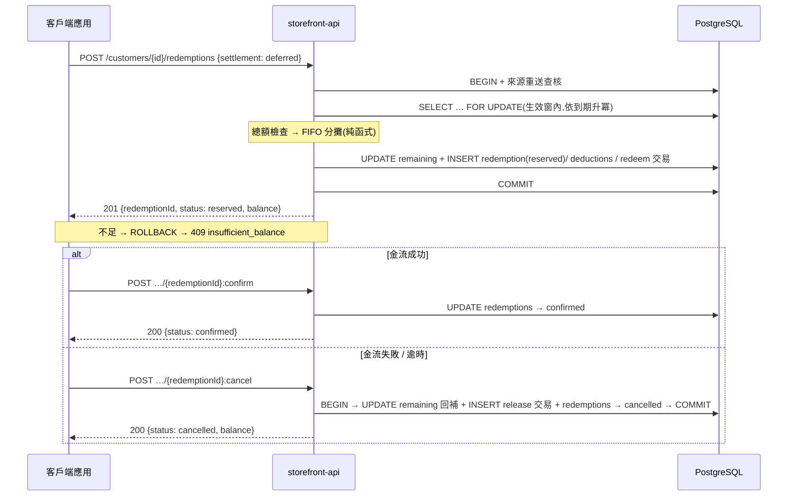

# API 合約

> UC 合約 + 系統合約 + 全域慣例。名詞與驗收見 [README.md](README.md)。
> **多租戶**:所有資源路徑一律以 `/shops/{shopId}` 為前綴,本文件路徑省略此前綴。
> **提供者**:UC-1/5/6 = `internal-api`(後台);UC-2/3/4 = `storefront-api`(前台系統串接,代客戶操作)。
> 兩者的呼叫端都是服務;瀏覽器直達的 `public-api`(客戶自查)列 v2,前提為客戶身分認證。

## UC-1 發點

三步:建立 → 上傳清單 → 送出。對象可達千萬級。

### ① 建立 — `POST /issuances`

| 欄位 | 必填 | 說明 |
|------|------|------|
| `amount` | ✓ | 每人發放數值,人人相同 |
| `expireOnDate` / `expireNever` | 二選一 | 日期須晚於現在 / `true` = 永久;相對天數由呼叫端換算成絕對時點 |
| `effectiveAt` | — | 省略 = 立即生效;須早於到期 |
| `author` + `sourceId` | ✓ | 業務冪等鍵,全域唯一 |

```jsonc
// 請求
{ "amount": 500, "effectiveAt": "2026-08-01T00:00:00+08:00",
  "expireOnDate": "2026-08-31T00:00:00+08:00", "author": "dispatcher", "sourceId": "campaign-2026-08" }
// 201 + Location: /issuances/{id}
{ "issuanceId": "…", "status": "draft" }
```

重送語意:

- 同 `(author, sourceId)` 同參數 → `200` 回既有紀錄。
- 異參數 → `409 source_already_exists`(附既有 `issuanceId`)。
- 補發、修復一律回同一筆 issuance。

### ② 上傳清單 — GCS resumable dialect

線上協定與 GCS resumable upload 同方言(bytes 語意)。
v2 讓 client 直傳 GCS 時,client 演算法零改動。

**開 session** — `POST /issuances/{id}/recipients` → `201` + `Location: <session URL>`

- `draft` / `failed` 可隨時開新 session:舊 session 作廢(不再引用;檔案保留,清理列 v2)。
- 一個 session = 一份完整清單。

**傳塊** — `PUT <session URL>`

- `Content-Type: application/x-ndjson`;body 一行一個 `{"customerId": "<uuid>"}`。
- `Content-Range: bytes X-Y/Z`;總量未知用 `*`,最後一塊帶實際總數。
- 非末塊須為 **256 KiB 倍數**,違者 `400`。
- 行可跨塊斷開,server 接合。
- 未完成 → `308 Resume Incomplete` + `Range: bytes=0-N`。
- 最後一塊 → `200` + `{uploadedCount}`(行數)。
- server 以完整行為持久化邊界,`N` 可能略小於已送量;client 一律以 `Range` 為準續送。

**查斷點** — 空 body `PUT` + `Content-Range: bytes */Z` → `308` + `Range`

**行級驗證** — 格式 / UUID 錯誤 → `422`(附行號),session 作廢,修正後開新 session。

### ③ 送出 — `POST /issuances/{id}:issue` → `202`

清單鎖定,開始入帳。

### 取消 — `POST /issuances/{id}:cancel`(軟刪除)

- 僅 `draft` 可取消 → `200 {"status": "cancelled"}`,記 `cancelledAt`;紀錄永久保留。
- `cancelled` 為不可逆終態;重複取消回當前狀態。
- **取消釋放來源**:同 `(author, sourceId)` 可重建修正版(同來源同時最多一筆活的)。
- 送出後不可取消(已入帳點數的處置屬 v2 adjust)。

### 保證

- **同批一致**:整批同一絕對生效/到期時間(建立當下換算)。
- **連續處理**:數萬人/秒;十萬級秒級、千萬級分鐘級;不逐人排隊。
- **冪等**:建立重送回既有;`:issue` 對進行中/完成回當前狀態,對 `failed` = 重試。
- **來源防重複**:同來源同客戶一生入帳一次;略過者計 `processedCount` 不計 `grantedCount`。

### 錯誤

| 碼 | 情境 |
|----|------|
| `422` | 欄位不合法;行格式/UUID 錯(session 作廢);session 未完成或 0 行即 `:issue` |
| `409` | 同來源已存在;對 `draft`/`failed` 以外狀態開 session 或傳塊;對非 `draft` 取消 |
| `400` | `Content-Range` 缺漏/格式錯;分塊粒度錯(`invalid_chunk_granularity`) |
| `308` | 非錯誤:續傳協定的正常回應 |

### 失敗與重做

- 崩潰(OOM / `kill -9`)→ ack_wait 逾時自動重投,他機冪等續跑;外部只見進度暫停。
- 暫時性故障(DB 斷線)→ 同樣重投,不進 `failed`。
- 永久性失敗(清單遺失、重試耗盡)→ `failed` + `failureReason`,進度保留。
- 重做一律在同一筆上:
  - 直接 `:issue` 重試(斷點補完)。
  - 清單救不回:開新 session 重傳 → `:issue`,只補缺的人。

## UC-2 兌換 — 預留 / 確認 / 取消

兌換是有狀態的生命週期:**預留**鎖定並扣點、**確認**定案、**取消**釋放回補。結帳這類「先扣點、金流成功才定案」的場景走兩階段;無金流的即時兌換一步結算。

**建立** — `POST /customers/{id}/redemptions`

```jsonc
// 請求;settlement 必填:deferred = 只預留(待確認)、immediate = 預留即確認
{ "author": "order-service", "sourceId": "order-9527", "amount": 400,
  "settlement": "deferred", "holdTtlSeconds": 900 }
// 201
{ "redemptionId": "…", "status": "reserved", "amount": 400, "balance": 100 }
// 409 — 錯誤附結構化欄位,呼叫端不解析 message
{ "error": { "code": "insufficient_balance",
             "message": "balance 300 is less than requested 400",
             "balance": 300, "requestedAmount": 400 } }
```

**確認** — `POST /customers/{id}/redemptions/{redemptionId}:confirm`

```jsonc
// 200(冪等:已 confirmed 回同結果)
{ "redemptionId": "…", "status": "confirmed" }
// 409 — 預留已被逾時取消(已 release);呼叫端據此以同 sourceId 重建
{ "error": { "code": "redemption_already_cancelled", "reason": "timeout" } }
```

**取消** — `POST /customers/{id}/redemptions/{redemptionId}:cancel`

```jsonc
// 200(冪等:已 cancelled 回同結果;已 confirmed → 409)——點數回補
{ "redemptionId": "…", "status": "cancelled", "balance": 500 }
```

- **絕不超扣**:預留即扣;不足整筆拒絕,任意併發下餘額不為負。
- **預留即佔用**:點數於預留當下離開可用餘額(扣 `remaining`),因為它已被那筆訂單吃走;取消以 `release` 交易原批補回。
- **來源即冪等**:同客戶同來源同參數重送 → `200` 回首次結果;異參數 → `409`;取消後同來源可重建。
- 扣點先扣最快到期、跨筆分攤;UC-4 留 `redeem`(預留)與 `release`(取消)交易含扣減明細。
- `immediate` = 原子完成預留 + 確認,回 `status: "confirmed"`,無 `holdTtlSeconds`。
- **取消發事件**:主動或逾時取消都在 tx 內發布 `points.redemption.cancelled.{author}`(`reason` 區分),供訂單/通知中心據以退款告知——尤其逾時取消,呼叫端本來不知情。

## UC-3 點數總覽 — `GET /customers/{id}/points`

```jsonc
// 200
{ "balance": 400,
  "batches": [
    { "customerPointId": "…", "originalAmount": 500, "remainingAmount": 300,
      "effectiveAt": "2026-07-16T00:00:00Z", "expiresAt": "2026-08-01T00:00:00Z" },
    { "customerPointId": "…", "originalAmount": 500, "remainingAmount": 500,
      "effectiveAt": "2026-08-01T00:00:00Z", "expiresAt": "2026-08-31T00:00:00Z" }
  ] }
```

- 餘額只計生效窗內批次;未生效批次列表可見(即將入袋)但不計入。
- 批次依到期升冪,與 FIFO 順序一致;永久點 `expiresAt` 回 `null`、排最後(與扣減順序一致)。

## UC-4 交易紀錄 — `GET /customers/{id}/transactions?limit=&offset=`

- `200 {total, entries}`,新到舊分頁。
- 每筆:時間、類型、來源、變動(±)、兌換扣減明細。
- 每筆都答得出「誰、憑什麼」。

## UC-5 發點進度 — `GET /issuances/{id}`

```jsonc
{ "issuanceId": "…", "shopId": "…", "recipientCount": 10000000, "processedCount": 6300000,
  "grantedCount": 6291800, "status": "processing", "amountPerRecipient": 500,
  "author": "dispatcher", "sourceId": "campaign-2026-08",
  "effectiveAt": "…", "expiresAt": "…",
  "createdAt": "…", "issuedAt": "…" }   // issuedAt:首次送出時間;draft/cancelled 為 null
```

- `failed` 時另含 `failureReason`(結構化 `{code, message, …}`,與錯誤格式同形);進度保留不歸零。
- `cancelled` 時另含 `cancelledAt`。
- `draft` 時另含 `uploadedCount` 與現行 session 的 `recipientsUploadUrl`。

## UC-6 清單下載 — `GET /issuances/{id}/recipients`

- `200` NDJSON 串流,與上傳同格式;千萬級可行(O(chunk))。
- 任何狀態可下載:draft/failed = 目前內容;送出後 = 鎖定快照(稽核)。
- 保證:下載行數 = `uploadedCount`。
- 核對流程:**上傳 → 下載核對 → `:issue`**。

## 系統合約(自動行為的承諾)

**A. 入帳必達終態**

- `:issue` 後有限時間內必到 `completed` 或 `failed`,絕不卡 `processing`。
- 故障、重試、重投不重複入帳。
- 終態發布 NATS 事件:`points.issuance.{completed|failed}.{author}`(payload 見「NATS 事件」)。

**B. 生效與到期 = 查詢級瞬間生效**

- 到達 `effective_at` 即計入餘額可兌換;到達 `expires_at` 即排除。不依賴排程。
- 到期留痕與事件由週期任務補上(預設 1h,`EXPIRE_INTERVAL` 可調),不影響餘額正確性。
- **每個過期批次發布一則 `points.batch.expired.{author}` 事件**(payload 見「NATS 事件」)——最細粒度事實,下游自行按店家/客戶/來源聚合(轉換、退補償等皆為訂閱方職責)。

**C. 兌換取消必被通知**

- 取消(主動或逾時)在同一 tx 內發布 `points.redemption.cancelled.{author}`,發布成功才 COMMIT——不丟事件。
- 逾時取消由點數中心自主發起、呼叫端不知情,故此事件是結帳 Saga 補償的回報路徑(訂單中心聚合 → 通知中心告知客戶)。

## NATS 事件(公開合約)

事件與 HTTP 同級,都是對外合約。共通語意:

- **at-least-once**:可能重複,訂閱方以各事件的去重鍵去重;跨事件順序不保證。
- payload 為扁平物件、欄位 camelCase;加欄位 = 非破壞演進,破壞性變更以新事件版本發布。
- 消費模式:各訂閱系統自建 durable **pull** consumer——批量、速率、斷點自主,獨立 cursor 可回放。
- **subject 分類學**:`points.<資源>.<事實>.<author>`,末段即冪等鍵的 `author`(發起系統)——發起方只訂自己的事件(如 `points.issuance.completed.marketing-center`),在 subject 層過濾、不必讀 payload 再丟棄;全量消費(對帳、監控)用萬用字元 `points.issuance.completed.*`。author 命名規約與訂閱治理屬事件中心(plan/backlog)。

### `points.issuance.completed.{author}` — 去重鍵 `issuanceId`

```jsonc
{ "shopId": "…", "issuanceId": "…",
  "author": "dispatcher", "sourceId": "campaign-2026-08",
  "recipientCount": 10000000, "processedCount": 10000000, "grantedCount": 9991800,
  "completedAt": "2026-08-01T00:12:34Z" }
```

### `points.issuance.failed.{author}` — 去重鍵 `issuanceId`(重試後再失敗會再發,屬新事實)

```jsonc
{ "shopId": "…", "issuanceId": "…",
  "author": "dispatcher", "sourceId": "campaign-2026-08",
  "recipientCount": 10000000, "processedCount": 6300000, "grantedCount": 6291800,
  "failureReason": { "code": "recipients_file_lost", "message": "…" },
  "failedAt": "…" }
```

### `points.batch.expired.{author}` — 去重鍵 `customerPointId`

```jsonc
{ "shopId": "…", "customerPointId": "…", "customerId": "…", "issuanceId": "…",
  "author": "dispatcher", "sourceId": "campaign-2026-08",
  "originalAmount": 500, "expiredAmount": 120,
  "effectiveAt": "2026-08-01T00:00:00Z", "expiresAt": "2026-08-31T00:00:00Z" }
```

### `points.redemption.cancelled.{author}` — 去重鍵 `redemptionId`

預留被取消(釋放回補)時發布;主動與逾時取消統一發此事件,`reason` 區分。`confirmed` 後不可取消,故無對應事件。

```jsonc
{ "shopId": "…", "redemptionId": "…", "customerId": "…",
  "author": "order-service", "sourceId": "order-9527",
  "amount": 400, "reason": "timeout", "cancelledAt": "…" }
// reason:"timeout"(逾時自動)| "caller_cancelled"(呼叫端主動,如金流失敗)
```

## API 慣例(全域)

- 名詞資源;狀態轉移用自訂方法(`POST …:issue`);`PATCH` 只更新欄位。
- 帶清單的資源統一生命週期:建立 → 開 session → 傳塊 → 顯式送出。
- 欄位 camelCase(DB 才 snake_case);數值欄位用 amount 系命名。
- 冪等一律靠 `(author, sourceId)`,無人工冪等鍵;唯一性以 shop 為界(issuance 於 shop 內唯一、redemption 於 shop 內同客戶唯一)。
- **租戶隔離為絕對規則**:一切查詢、唯一鍵、事件都以 `shopId` 起頭;跨 shop 互不可見。
- **刪除一律軟刪除**:無物理 DELETE 端點;刪除語意以狀態表達(`cancelled`),紀錄永久保留。
- headers 不承載業務資料;`Content-Range`/`Range`、`X-Request-Id` 屬傳輸/觀測層。
- **X-Request-Id**:回應一律帶;有帶沿用、沒帶生成(UUID v7);log 全程附 `request_id`。
- 狀態碼:`201`+Location、`202`(非同步)、`308`+Range(續傳)、`400`(傳輸層)、`409`(衝突)、`422`(參數)。
- 錯誤格式:`{"error": {"code", "message", …結構化欄位}}`;呼叫端不解析 message。
- 完整性錯誤(如帳本負剩餘)一律 `500`:細節只進 log 與告警,不外洩給呼叫端。
- **JSON 容器規約**:頂層與 JSONB 欄位不用裸 array——先物件、明確欄位再接 array(如 `{"entries": […]}`),為擴充留位。
- 分頁 `?limit=&offset=` 回 `total`;`GET /healthz` 不受資源慣例約束。

## Issuance 狀態圖



- `completed`、`cancelled` 不可逆;`failed` 可重入。

## Redemption 狀態圖



- `confirmed`、`cancelled` 皆終態不可逆;confirmed 後要退點屬退款(不做),非取消。
- 逾時預留由 job 走 `cancel` 兜底(見 internals 逾時預留取消)。

## 時序圖

**發點全流程**



**兌換(預留 → 確認 / 取消,悲觀鎖)**


