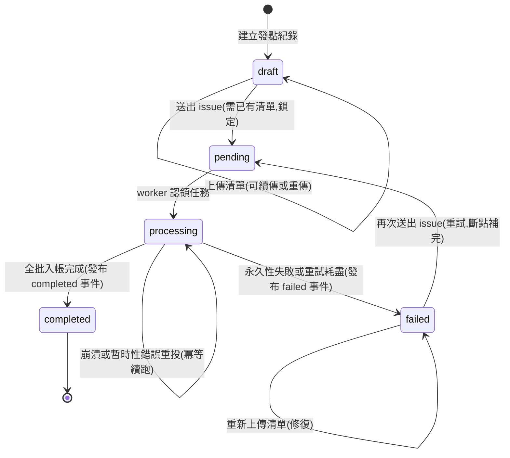
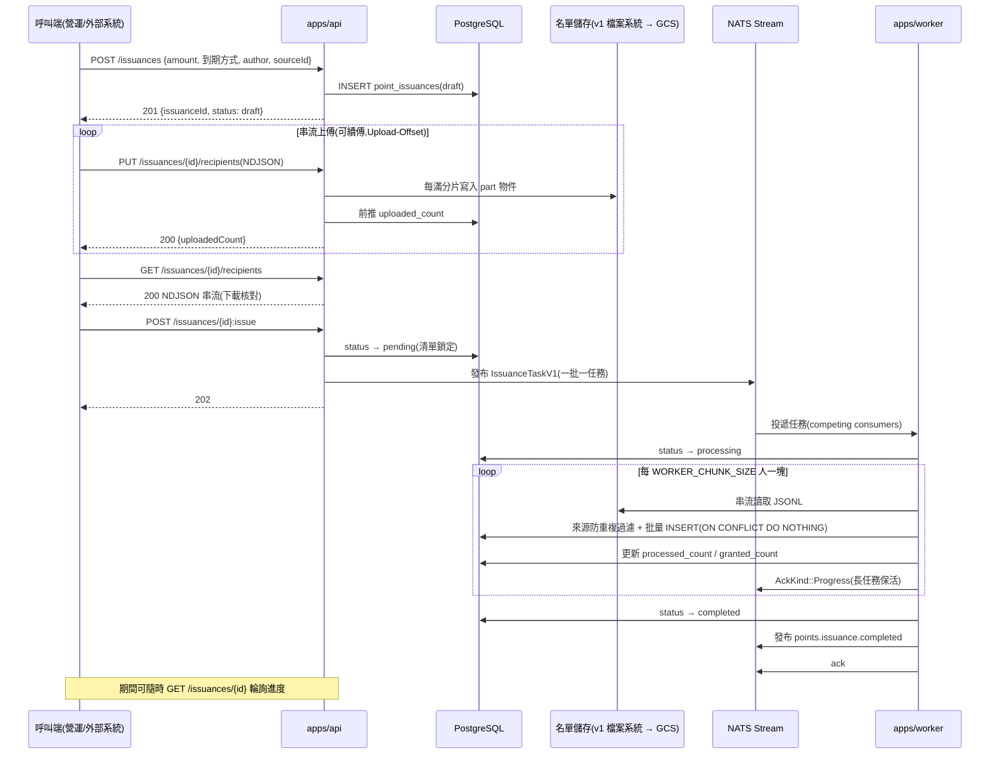
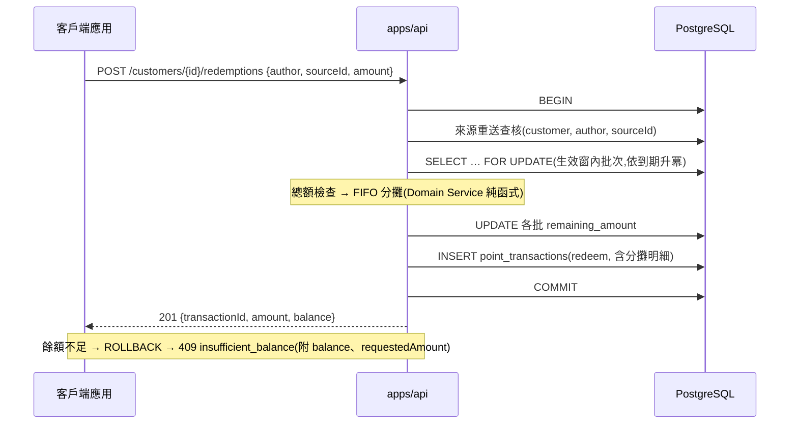

# 01 — 點數中心系統 Spec(v1)

> 狀態:**待審查**(修訂 r18:**全帳本統一來源模型**——`idempotencyKey` 概念廢除,發點與兌換的重送保護、防重複、溯源一律由 `(author, sourceId)` 承擔;issuance 層來源唯一、新增 `GET …/recipients` 下載、failed 可修復重試;r17:camelCase / amount 命名 / `:issue`;r16:生效窗;r15:移除發送排程器)
> 前置討論已定案:tokio 技術線、NATS JetStream、PostgreSQL + sqlx、JSON 訊息格式、六角架構、商業導向命名、REST 資源慣例(自訂方法、可續傳上傳)、UUID v7、docker compose + make 的開發流程。

## 1. 核心概念與邊界

**點數中心只做帳務**:發點入帳、兌換、餘額、到期、交易紀錄——不變量密集、絕對不能錯的部分。

**明確不做「何時發、發給誰」的決策**:發送排程器(單次/週期排程、動態名單)屬於另一個限界上下文,由 monorepo 內未來的獨立 app 負責;它和名單中心一樣,是本系統公開 API 的**外部呼叫方**——建立發點紀錄、推送 JSONL 名單、觸發送出,全部走與人工營運相同的合約,沒有任何特權通道。

```
┌─ 外部呼叫方 ────────────┐
│ 營運後台(人工)          │           ┌──────── 點數中心(本系統)────────┐
│ 發送排程器(未來 app)    │──公開 API──▶│ 發點入帳 │ 兌換 │ 餘額/到期 │ 帳本 │
│ 名單中心(推送 JSONL)    │           └──────────────────────────────────┘
└─────────────────────────┘
```

Customer 本身不在本系統管理,識別碼為外部系統的 **UUID v7**。

---

## 2. 名詞定義(Ubiquitous Language)

| 名詞                            | 定義                                                                                                                                                                                                                                                                                                                                                                              | 範例                                                                                |
| ------------------------------- | --------------------------------------------------------------------------------------------------------------------------------------------------------------------------------------------------------------------------------------------------------------------------------------------------------------------------------------------------------------------------------- | ----------------------------------------------------------------------------------- |
| **客戶識別碼(customer_id)**     | 外部系統核發的 **UUID v7**,本系統不驗證其存在性;全系統(含本系統產生的各種 ID)統一採用 UUID v7                                                                                                                                                                                                                                                                                     | `018f3a2e-9b1c-7d4e-a5f6-1234567890ab`                                              |
| **點數(points)**                | 客戶可用於折抵的虛擬資產,為**領域概念名**;規格中的**數值欄位一律以 amount 表達**(如 `amount`、`originalAmount`、`remainingAmount`),正整數;本系統不定義兌換匯率                                                                                                                                                                                                                    | `500`                                                                               |
| **點數批次(point batch)**       | 一次入帳產生的一批點數,同批共享同一個到期時間;客戶的持有點數是多個批次的集合                                                                                                                                                                                                                                                                                                      | 7/16 入帳 500 點、8/15 到期,為一批                                                  |
| **餘額(balance)**               | 客戶所有**已生效且未過期**批次的剩餘點數總和,即時計算                                                                                                                                                                                                                                                                                                                             | 批次 A 剩 300 + 批次 B 剩 100 = 餘額 400                                            |
| **生效時間(effectiveAt)**       | 這批點數**開始可用**的時間點;發點時可選指定(省略 = 發點當下立即生效)。點數僅在生效窗 **[生效, 到期)** 內可查入餘額、可兌換                                                                                                                                                                                                                                                        | 7/16 發點、8/1 生效:8/1 前餘額不計入、不可兌換                                      |
| **到期方式(expiration type)**   | 決定發出的點數何時失效的規則,**二選一**:<br>① **指定日期到期(expireOnDate)**:這次發的所有點數在同一個指定時間點失效<br>② **領取後 N 天到期(expireAfterDays)**:自**生效時刻**起算 N 天後失效(未指定生效時間 = 發點時刻起算;整批一致,不因入帳先後而異)                                                                                                                              | ① 2026-12-31 23:59 全部失效<br>② N=30,8/1 生效 → 8/31 失效                          |
| **對象清單(recipient list)**    | 一次發送的目標集合,**可達千萬級**;以 **JSONL** 格式串流上傳(一行一個 `{"customerId": "<uuid>"}`),不內嵌在 JSON request body。**v1 僅支援會員(customer UUID);v2 擴充會員群組**。行格式為 JSON 物件正是為此預留擴充空間                                                                                                                                                             | 千萬人 ≈ 數百 MB,串流傳輸                                                           |
| **發點紀錄(issuance)**          | 一次發點行為的紀錄與追蹤單位:來源、對象數、處理進度、何時發                                                                                                                                                                                                                                                                                                                       | —                                                                                   |
| **異動來源(author + sourceId)** | **每筆異動必帶**,全帳本統一語彙:**author**(誰,開放集合:`manual` 手動、`dispatcher` 發點器、`code_redemption` 代碼兌點服務、`order-service` 商城訂單、`system` 系統到期…)與 **sourceId**(該來源下的識別碼:活動 ID、訂單號、客服單號、過期批次 ID…)。來源同時承擔**重送保護**與**溯源**:發點——一個來源恰一筆 issuance,同客戶一生入帳一次;兌換——同客戶同來源恰一筆扣點;到期——系統自動標注。要重複發放(如週週發)以不同 sourceId 表達(如「活動ID:期數」) | 發點:`dispatcher` + `campaign-2026-08`;兌換:`order-service` + `order-9527`         |
| **兌換(redemption)**            | 客戶用點數折抵消費,扣減餘額;絕不允許超扣                                                                                                                                                                                                                                                                                                                                          | 兌換 400 點折抵運費                                                                 |
| **FIFO 扣點**                   | 兌換時先扣**最快到期**的批次,跨批分攤                                                                                                                                                                                                                                                                                                                                             | 持有:批次 A 300 點(8/1 到期)、批次 B 500 點(9/1 到期);兌換 400 → A 扣 300、B 扣 100 |
| **交易紀錄(transaction)**       | 每次點數異動的留痕:發點(+)、兌換(−)、到期(−)、調整(±)                                                                                                                                                                                                                                                                                                                             | —                                                                                   |

---

## 3. Use Cases(第一層:合約——打什麼 API,可以看到什麼)

### 3.0 角色與總覽

- **營運人員**(經營運後台):發點、追蹤發放進度。
- **外部系統**(發送排程器、名單中心):以機器身分走同一套發點合約。
- **客戶端應用**(商城 / App,代客戶操作):兌換、查餘額與到期、查交易紀錄。

| UC   | 名稱           | 類型 | 角色              | API                                                            |
| ---- | -------------- | ---- | ----------------- | -------------------------------------------------------------- |
| UC-1 | 發點           | 操作 | 營運 / 外部系統   | `POST /issuances` → `PUT …/recipients`(可續傳)→ `POST …:issue` |
| UC-2 | 兌換點數       | 操作 | 客戶端應用        | `POST /customers/{id}/redemptions`                             |
| UC-3 | 客戶點數總覽   | 檢視 | 客戶端應用        | `GET /customers/{id}/points`                                   |
| UC-4 | 交易紀錄       | 檢視 | 客戶端應用 / 營運 | `GET /customers/{id}/transactions`                             |
| UC-5 | 發點紀錄與進度 | 檢視 | 營運 / 外部系統   | `GET /issuances/{id}`                                          |
| UC-6 | 對象清單下載   | 檢視 | 營運 / 外部系統   | `GET /issuances/{id}/recipients`                               |

系統的自動行為(入帳完成、點數到期)以「**系統合約**」形式定義在 §3.6——只描述可觀察的承諾,不描述實作。

---

### UC-1 發點

**情境**:營運人員(客服補償、活動獎勵)或外部系統(發送排程器到點觸發)對一批客戶發點;對象可達**千萬級**。

**步驟一:建立發點紀錄** — `POST /issuances`

| 欄位                   | 必填            | 定義                                              | 範例                        |
| ---------------------- | --------------- | ------------------------------------------------- | --------------------------- |
| 每人發放數值(amount)   | ✓               | 每位對象獲得的點數數值,正整數,人人相同            | `500`                       |
| 到期方式               | ✓               | 單選,定義見 §2                                    | 領取後 N 天到期             |
| └ 指定日期時間         | 到期方式①時必填 | 點數失效的時間點,須晚於現在                       | `2026-12-31T23:59:00+08:00` |
| └ 天數                 | 到期方式②時必填 | 生效起算的有效天數,≥1                             | `30`                        |
| 生效時間(effectiveAt)  | —               | 可選,見 §2;省略 = 發點當下立即生效;須早於到期時間 | `2026-08-01T00:00:00+08:00` |
| 來源(author)           | ✓               | 見 §2;誰發的                                      | `dispatcher`                |
| 來源識別碼(sourceId)   | ✓               | 見 §2;同 (author, sourceId) 同客戶一生最多一次    | `campaign-2026-08`          |

```jsonc
// 請求(8/1 生效、生效後 30 天到期)
{ "amount": 500, "effectiveAt": "2026-08-01T00:00:00+08:00",
  "expireAfterDays": 30,
  "author": "dispatcher", "sourceId": "campaign-2026-08" }
// 201 Created + Location: /issuances/{id}
{ "issuanceId": "…", "status": "draft" }
```

**發點不需要冪等鍵——`(author, sourceId)` 就是業務冪等鍵**(一個來源恰對應一筆 issuance,層級唯一約束)。重送語意:同 `(author, sourceId)` 且**參數一致**的 POST → `200` 回既有紀錄(逾時重送安全);**參數不一致** → `409 source_already_exists`(附既有 `issuanceId`)。補發、修復一律回到**同一筆 issuance** 操作(見失敗與重做),不會有第二筆同來源紀錄。

對象清單**一律**走步驟二的 JSONL 串流上傳——不提供 body 內嵌通道,**一人與一千萬人走同一條路**。

**步驟二:串流上傳對象清單(可續傳)** — `PUT /issuances/{id}/recipients`

- `Content-Type: application/x-ndjson`,body 一行一個 `{"customerId": "<uuid>"}`,可達千萬行、數百 MB,串流傳輸。
- **續傳**:header `Upload-Offset: <已上傳行數>`(省略 = 0,從頭重傳);中斷後以 `GET /issuances/{id}` 取回 `uploadedCount` 與 `recipientsUploadUrl`,從斷點補傳。
- → `200 {uploadedCount}`;`draft` 期間可分多次附加,也可歸零重傳。

**步驟三:送出** — `POST /issuances/{id}:issue` → `202`,清單鎖定,開始入帳。

**呼叫後可觀察到什麼**

1. 步驟一後:UC-5 可查,`status=draft`;draft 期間回應含 `uploadedCount` 與 `recipientsUploadUrl`(隨時可續傳)。
2. `:issue` 後:`status=pending` → `processing`,`processedCount` 持續推進 → `completed`。
3. 完成後:每位入帳對象在 UC-3 看到新批次(點數與到期時間正確)、UC-4 出現一筆 `grant` 交易。

**保證**

- **同批一致**:整批共用同一個絕對生效時間與到期時間(步驟一當下換算)。
- **連續處理**:整批以批量速率(數萬人/秒)連續入帳,十萬級秒級完成、千萬級分鐘級完成;**絕不逐人排隊,不會出現小時級落差**。
- **冪等**:`POST /issuances` 重送(同來源同參數)回既有紀錄;`:issue` 對進行中/已完成回當前狀態、不重複入帳,對 `failed` 則為**重試**(見下方失敗與重做)。
- **來源防重複**:同一 `(author, sourceId)` 對同一客戶一生最多入帳一次——同一份清單重複行、任務重投、以及日後同來源再次發點,已領過者自動略過(計入 `processedCount`、不計入 `grantedCount`),其餘照發。

**錯誤**

- `422`:`amount` ≤ 0、到期方式缺漏或兩者同時給、指定日期早於現在、生效時間晚於或等於到期時間、`author` / `sourceId` 缺漏、JSONL 行格式或 UUID 不合法、`uploadedCount = 0` 即 `:issue`。
- `409`:同 `(author, sourceId)` 已存在發點紀錄(`source_already_exists`,附既有 `issuanceId`);`Upload-Offset` 與伺服器 `uploadedCount` 不一致(附 `uploadedCount`);對 `draft` / `failed` 以外狀態上傳。

**失敗與重做(Failed / Redo)**

失敗視角——什麼會失敗、外部怎麼看到:

- **行級資料錯誤不存在於任務期**:JSONL 行格式、UUID 合法性都在上傳階段擋下(`422`),送出後的任務沒有髒資料。
- **程序崩潰類**(OOM、container 被回收、`kill -9`、斷電):worker **來不及做任何標記就消失**——不依賴 worker 善後,靠訊息層自癒:心跳隨程序停止 → ack_wait 逾時 → 自動重投給其他 worker 冪等續跑。外部觀察 = 進度暫停(上限約一個 ack_wait)後繼續推進。
- **暫時性故障不進 failed**:DB 連線失敗/短暫不可用等,自動重投續跑;外部同樣只看到進度暫停,不需介入。
- **永久性失敗才進 `failed`**:對象清單檔案遺失/毀損、重試耗盡——`status=failed` + `failureReason`(UC-5 可查),**已入帳進度保留不歸零**。
- **必達終態**:`:issue` 之後,發點紀錄保證在有限時間內到達 `completed` 或 `failed`,不會有永遠卡在 `processing` 的殭屍紀錄。

重做視角——**一律在同一筆 issuance 上修復**(一個來源恰一筆紀錄),皆天然防重複:

1. **直接重試**:對 `failed` 呼叫 `POST /issuances/{id}:issue` → `202`,狀態回 `pending` 重新入列;已入帳者由來源唯一鍵自動略過,**從斷點補完**。適用:根因已排除(如 DB 恢復)。重試不限次數。
2. **修復清單後重試**:原清單救不回(如檔案遺失)時,`failed` 狀態**允許重新上傳清單**(`PUT …/recipients`,可續傳/整份重傳,下載端點可先確認現況)→ 再 `:issue`。已入帳者同樣被來源唯一鍵略過,只補發缺的人。**不開第二筆同來源紀錄**,對帳永遠只看一筆。

---

### UC-2 兌換點數

**情境**:客戶消費時用點數折抵;高併發下**絕不允許超扣**。

**輸入欄位**

| 欄位                   | 必填 | 定義                        | 範例                  |
| ---------------------- | ---- | --------------------------- | --------------------- |
| 來源(author)           | ✓    | 見 §2;誰觸發這筆兌換        | `order-service`       |
| 來源識別碼(sourceId)   | ✓    | 見 §2;同客戶同來源恰一筆扣點 | `order-9527`          |
| 兌換數值(amount)       | ✓    | 本次要折抵的點數數值,正整數 | `400`                 |

**合約**:`POST /customers/{id}/redemptions`(路徑中 `{id}` 為 customer UUID)

```jsonc
// 請求
{ "author": "order-service", "sourceId": "order-9527", "amount": 400 }
// 201 Created
{ "transactionId": "…", "amount": 400, "balance": 100 }
// 409 Conflict — 錯誤附帶結構化欄位,呼叫端不需解析 message
{ "error": { "code": "insufficient_balance",
             "message": "balance 300 is less than requested 400",
             "balance": 300, "requestedAmount": 400 } }
```

**呼叫後可觀察到什麼**

1. 立即:回應含扣點後餘額。
2. UC-3:各批次剩餘點數依 **FIFO 規則**減少(先扣最快到期的批次,見 §2 範例)。
3. UC-4:出現一筆 `redeem` 交易,含「從哪些批次各扣多少」的明細。

**保證**

- **絕不超扣**:餘額不足整筆拒絕(`409`),不做部分兌換;任意併發下客戶餘額不會為負。
- **重送保護(來源即冪等)**:同客戶同 `(author, sourceId)` 且參數一致的重送 → `200` 回首次結果,不重複扣點;參數不一致 → `409 source_already_exists`。交易紀錄天生可回答「這筆扣點是哪張訂單」。

---

### UC-3 客戶點數總覽(檢視)

**情境**:客戶打開「我的點數」頁面——現在有多少點?哪些快到期?

**合約**:`GET /customers/{id}/points`

```jsonc
// 200
{
  "balance": 400,
  "batches": [
    {
      "customerPointId": "…",
      "originalAmount": 500,
      "remainingAmount": 300,
      "effectiveAt": "2026-07-16T00:00:00Z",
      "expiresAt": "2026-08-01T00:00:00Z",
    },
    {
      "customerPointId": "…",
      "originalAmount": 100,
      "remainingAmount": 100,
      "effectiveAt": "2026-07-16T00:00:00Z",
      "expiresAt": "2026-09-01T00:00:00Z",
    },
    {
      "customerPointId": "…",
      "originalAmount": 500,
      "remainingAmount": 500,
      "effectiveAt": "2026-08-01T00:00:00Z",
      "expiresAt": "2026-08-31T00:00:00Z",
    },
  ],
}
// balance = 400:第三批尚未生效,列表可見(客戶知道「即將入袋」)但不計入餘額
// originalAmount(原始發放)對照 remainingAmount(剩餘),客戶可見「這批用掉多少」
```

**保證**

- **餘額只計生效窗內的批次**:未生效與已過期即時排除(生效與到期都是查詢級瞬間生效,見 §3.6 系統合約 B);未生效批次仍在列表中供客戶預期。
- 批次依到期時間升冪(最快到期在前),與 FIFO 扣點順序一致。

---

### UC-4 交易紀錄(檢視)

**情境**:客戶或營運查「點數怎麼來、怎麼用掉的」。

**合約**:`GET /customers/{id}/transactions?limit=&offset=` → `200 {total, entries: […]}`

**每筆呈現**:時間、類型(發點 / 兌換 / 到期 / 調整)、**來源(`author` + `sourceId`,如「order-service / order-9527」)**、點數變動(+/−)、兌換明細(從哪些批次各扣多少);新到舊,分頁。每一筆都回答得出「誰、憑什麼」。

---

### UC-5 發點紀錄與進度(檢視)

**情境**:營運或外部系統確認「這次發送發給幾個人、進度如何、實際入帳幾人」。

**合約**:`GET /issuances/{id}`

```jsonc
// 200
{
  "issuanceId": "…",
  "recipientCount": 10000000,
  "processedCount": 6300000,
  "grantedCount": 6291800,
  "status": "processing",
  "amountPerRecipient": 500,
  "author": "dispatcher",
  "sourceId": "campaign-2026-08",
  "effectiveAt": "2026-08-01T00:00:00Z",
  "expiresAt": "2026-08-31T00:00:00Z",
  "issuedAt": "…",
}
```

**呈現**:發送時間、來源(`author` + `sourceId`)、對象數、處理進度(`draft` → `pending` → `processing` → `completed` | **`failed`** + 已處理人數)、**實際入帳人數**(`grantedCount`;來源防重複略過者計入 processed 但不計入 granted)、整批生效與到期時間。

`failed` 時回應另含 `failureReason`(人可讀原因);已入帳的進度(`processedCount` / `grantedCount`)保留不歸零——營運據此判斷是否重新 `:issue` 補完(見系統合約 A)。

`draft` 狀態時回應另含 `uploadedCount` 與 `recipientsUploadUrl`——上傳中斷後由此取回進度與位址,續傳(見 UC-1 步驟二)。

---

### UC-6 對象清單下載(檢視)

**情境**:送出前的最後確認——「上傳的名單是完整、正確的嗎?」;以及事後稽核「這次到底發給了誰?」。

**合約**:`GET /issuances/{id}/recipients`

- 回應 `200`,`Content-Type: application/x-ndjson`,**串流下載**與上傳同格式的完整清單(一行一個 `{"customerId": "<uuid>"}`),千萬級同樣可行(記憶體 O(chunk))。
- 任何狀態皆可下載:`draft` / `failed` 下載的是目前已上傳的內容(核對後決定續傳、重傳或 `:issue`);送出後下載的是鎖定的名單快照(稽核)。

**保證**:下載內容 = 伺服器實際持有的清單(行數與 `uploadedCount` 一致),是「多層確認」流程的核對依據:**上傳 → 下載核對 → `:issue`**。

---

### 3.6 系統合約(自動行為的可觀察承諾)

**A. 入帳完成(或明確失敗)**

- 發點紀錄**送出**(`pending`)後,系統以批量速率(數萬人/秒)連續完成整批入帳:UC-5 進度推進至 `completed`,所有入帳對象的 UC-3 / UC-4 同步可見。
- 任何系統故障、重試、重複投遞,都**不會造成重複入帳**;暫時性中斷後會自動續跑。
- **必達終態**:有限時間內必到 `completed` 或 `failed`(`failureReason` 可查、進度保留),絕不永久停在 `processing`;`failed` 可依 UC-1「失敗與重做」恢復。
- **完成通知(事件發布)**:到達終態時發布業務事件至 NATS——`points.issuance.completed` / `points.issuance.failed`(含 `issuanceId`、`author`、`sourceId`、`recipientCount`、`grantedCount`;失敗另含 `failureReason`),訂閱者自行訂閱;輪詢 `GET /issuances/{id}` 永遠可用。
- 來源防重複(同一 `(author, sourceId)` 同客戶一生最多一次)在任意併發、重試、重做下仍成立。

**B. 點數生效與到期**

- 批次到達 `effective_at` 的瞬間,UC-3 餘額立即計入、可供兌換;到達 `expires_at` 的瞬間,立即不再計入——**兩者皆為查詢級生效**,不依賴任何排程。
- 到期稍後(分鐘級)UC-4 會出現對應的 `expire` 交易留痕;留痕的時間差**不影響**餘額正確性。生效不產生交易(發點時已有 `grant` 交易)。

---

### 3.7 API 慣例(全域,統一契約)

- 所有路徑都是**名詞資源**;動作以「建立資源」表達(發點 = 建立 issuance、兌換 = 建立 redemption)。
- **狀態轉移用自訂方法**(Google AIP-136 風格):`POST /{resource}/{id}:verb`(`:issue`);`PATCH` 僅用於欄位更新,不承載狀態轉移。
- **統一生命週期**:帶對象清單的資源一律三步——`POST` 建立(draft)→ `PUT …/recipients` 上傳清單 → 自訂方法顯式送出;上傳僅允許於**可編輯狀態**(`draft`,以及 `failed` 的清單修復),上傳前送出一律 `422`。
- **上傳有對應的下載**:`GET …/recipients` 以同格式串流下載完整清單,供送出前核對與事後稽核(上傳 → 下載核對 → `:issue`)。
- **命名規約**:API JSON 欄位一律 **camelCase**(`issuanceId`、`effectiveAt`);snake_case 僅存在於 DB 欄位。數值欄位以 **amount** 概念命名(`amount`、`originalAmount`、`remainingAmount`),`points` 保留為領域概念名不作欄位。
- **大資料上傳(可續傳)**:對象清單**唯一**的傳遞方式是 `PUT …/recipients`、`Content-Type: application/x-ndjson` 串流(JSONL,一行一個 `{"customerId": "<uuid>"}`);一人與一千萬人同一條路,無內嵌通道。支援 `Upload-Offset` header 續傳,`GET` 資源可隨時取回 `uploadedCount` 與 `recipientsUploadUrl` 從斷點補傳;offset 不一致回 `409`。
- **上傳端點是系統整合面(M2M)**:`PUT …/recipients` 不限營運後台使用——外部系統(名單中心、發送排程器)直接對此網址推送 JSONL;`recipientsUploadUrl` 由 `GET` 回應提供即為此設計(機器可發現)。無論名單來源為何,**一律 JSONL、一律同一條入帳管線**。
- **冪等(來源即冪等鍵,無人工鍵)**:所有異動的重送保護一律用來源業務鍵 `(author, sourceId)`——issuances 全域唯一、redemptions 同客戶內唯一;同參數重送回既有結果(`200`)、異參數 `409 source_already_exists`。自訂方法重複呼叫回當前狀態,不重複執行;PUT/PATCH 本身即冪等語意。
- **headers 不承載業務資料**:業務欄位一律走 body;`Content-Type`、`Upload-Offset` 屬傳輸層語意,不在此限。
- **狀態碼**:`201` + `Location`(建立);`202`(觸發非同步處理);`204`(刪除);`409`(餘額不足、狀態衝突);`422`(參數不合法)。
- **分頁**:`?limit=&offset=`,回應含 `total`。
- 錯誤格式:`{"error": {"code": "...", "message": "...", …結構化欄位}}` —— `code` 供程式分支、`message` 供人閱讀,**每種錯誤型別附帶自己的結構化欄位**讓呼叫端直接取用,不必解析 message。例:`insufficient_balance` 附 `balance`、`requestedAmount`;`upload_offset_mismatch` 附 `uploadedCount`(伺服器目前收到的行數,直接據此續傳)。
- `GET /healthz`:運維端點,不受資源慣例約束。

### 3.8 Issuance 狀態圖



- `completed` 為唯一不可逆終態;`failed` 為可重入終態(修復清單、重試皆合法)。
- 兌換為同步操作,無狀態機(成功即成交易、失敗即拒絕)。

### 3.9 系統時序圖

**發點全流程(UC-1 + 系統合約 A)**



**兌換(UC-2,悲觀鎖策略)**



---

## 4. Domain 設計(第二層:商業規則)

### 4.1 聚合與實體

| 聚合                 | 職責                                                                                   | 關鍵純函式(可直接單測)                                                                                              |
| -------------------- | -------------------------------------------------------------------------------------- | ------------------------------------------------------------------------------------------------------------------- |
| **Issuance**         | 發點紀錄與處理進度(draft → pending → processing → completed \| failed)、來源(author + source_id) | 狀態轉移的合法性(draft 與 **failed** 可收/替換清單;送出需已有清單;送出後鎖定;**failed → pending 重試合法、completed 為不可逆終態**);生效/到期換算(規則 → 絕對時間窗,驗證生效 < 到期) |
| **CustomerPoints**   | 客戶持有的點數批次集合                                                                 | **FIFO 分攤演算法(Domain Service)**:輸入(各批剩餘數值、到期日)+ 欲兌換數值 → 輸出每批扣多少;餘額不足回領域錯誤                      |
| **PointTransaction** | 交易紀錄(grant/redeem/expire/adjust)                                                   | 不變量:`amount_change` 正負與 `transaction_type` 一致                                                               |

### 4.2 領域規則

1. **生效與到期是規則、點數只有絕對時間窗**:發點當下換算出 `[生效, 到期)`,整批一致(見 §2 名詞定義);點數僅在窗內可查入餘額、可兌換,窗的兩端都是查詢級瞬間生效。
2. **一次發點是一個整體**:連續批量處理,不逐人排隊;落差與人數線性但以萬人/秒計。
3. **來源防重複**:同一 `(author, source_id)` 同客戶一生最多入帳一次;任意併發、重試、重複名單下皆成立。
4. **FIFO 兌換**:於已生效未過期的批次中按 `expires_at` 升冪跨批分攤;餘額不足整筆拒絕。
5. **餘額定義**:生效窗內批次的 `remaining_amount` 總和,即時計算、不留快照。
6. **冪等**:所有異動都有冪等防線;重複請求回首次結果,非錯誤。
7. domain crate 不依賴 tokio/sqlx/NATS——分攤、換算、狀態機全是純函式。

### 4.3 六角架構 × 乾淨架構分層

乾淨架構的同心圓對應到 crate 結構——**Use Case layer 是獨立的一層**,不是 adapters 也不是 domain:

```
外圈 ◀──────────────────────────────────────────────────────▶ 內圈

Frameworks &        Interface Adapters          Use Cases            Entities
Drivers              (轉譯,不含業務)           (編排,交易邊界)      (商業規則)
─────────────       ─────────────────────      ─────────────────    ─────────────
axum / sqlx /       Presentation:              Application Service  domain::
tokio / NATS         Controller + Presenter     = use case           Issuance、
                     (HTTP DTO 的家)            interactor           CustomerPoints、
                    Gateways:                  (commands/queries)   PointTransaction、
                     repositories / queries                          Domain Service
                     adapters(infra)                                (FIFO 分攤)
```

**Service 術語釐清(三個不同概念,不再撞名):**

| 術語 | 位置 | 是什麼 |
|------|------|--------|
| **Domain Service** | domain 層 | 跨實體/跨批次的無狀態領域邏輯——**FIFO 分攤演算法**屬此(輸入多個批次 + 兌換數值 → 各批扣多少),仍是純函式 |
| **Application Service** | application 層 | 即 use case interactor(commands / queries),編排與交易邊界 |
| **`apps/`(原 `services/`)** | 部署層 | 純執行檔目錄(api、worker),**不是任何一種 service 層**——為避免術語衝突,目錄改名 `apps/` |

**Use Case layer——CQRS 分離,Command 與 Query 是兩種公民:**

**Commands(`application/commands/`)——改變狀態,走 domain、持交易邊界:**

| Command | 對應 | 編排內容(驗證 → domain → outbound ports) |
|---------|------|---------------------------------------------|
| `CreateIssuance` | UC-1 步驟一 | 驗證欄位 → `Issuance::new`(生效/到期換算)→ `IssuanceRepository::insert` |
| `UploadRecipients` | UC-1 步驟二 | 狀態檢查(draft)→ 逐行驗證 → `RecipientListStore::append` → 前推 uploaded_count |
| `IssueIssuance` | UC-1 步驟三(`:issue`) | 狀態轉移(domain 驗證)→ `GrantTaskPublisher::publish` → 存檔 |
| `RedeemPoints` | UC-2 | 來源重送查核 → 取有效批次 → **FIFO 分攤(Domain Service)** → `CustomerPointsRepository`(tx + 鎖策略)|
| `ProcessIssuanceTask` | 系統合約 A(worker)| 串流讀清單 → 來源防重複過濾 → 分塊批量入帳 → 更新進度 → 完成 |
| `ExpirePoints` | 系統合約 B(worker 週期)| 過期批次歸零 + expire 交易 |

**Queries(`application/queries/`)——唯讀,不經 domain 聚合、無鎖、無交易:**

| Query | 對應 | 特性 |
|-------|------|------|
| `GetCustomerPoints` | UC-3 | 餘額 = SQL `SUM`(生效窗過濾在查詢裡),直接回 Read Model,不重建聚合 |
| `ListTransactions` | UC-4 | 分頁查詢,直接投影成 Read Model |
| `GetIssuance` | UC-5 | 進度讀取(processed/granted counts),draft 時附上傳進度 |

- **Command 側**走 `ports/repositories`(悲觀/樂觀鎖、tx);**Query 側**走獨立的 `ports/queries`(唯讀 trait,直接回 Read Model,跳過 Entity 重建)——兩側連 outbound port 都分開,查詢永遠不會意外拿到可變聚合。
- 系統合約 B(生效/到期查詢級瞬間生效)本質上就是 Query 側規則:過濾條件長在查詢裡,不依賴 Command 側排程。
- v1 讀寫共用同一個 PG(邏輯 CQRS);物理分離(read replica、餘額 projection/快取)列 v2,介面已就位——屆時只換 `ports/queries` 的 adapter。

- **use case 持有交易邊界**:一個 interactor 的一次執行 = 一個業務一致性單位;tx 的開合由它決定,adapters 只執行。
- **use case 不含商業規則**:FIFO 分攤、生效/到期換算、狀態轉移合法性都在 domain 純函式;interactor 只負責「編排」——什麼順序呼叫誰、成功失敗怎麼回。

**Use Case 邊界:Controller → Input Port → Interactor → Presenter(presentation)**

```
HTTP Request(JSON camelCase)
   │
   ▼
Controller(presentation,位於 apps/api:axum handler)
   │  ① 反序列化 → 轉成 Request Model(application 定義)
   ▼
Input Port(trait,application)◀── Interactor 實作
   │  ② 編排:domain 純函式 + outbound ports(tx 邊界)
   ▼
Response Model / ApplicationError(application 定義,不知道 HTTP)
   │
   ▼
Presenter(presentation,位於 apps/api)
   │  ③ Response Model → HTTP view model(camelCase JSON、狀態碼、Location header)
   │     ApplicationError → 結構化錯誤格式({code, message, …欄位})
   ▼
HTTP Response
```

- **每層有自己的資料模型,跨界必轉換**(乾淨架構的資料規則):

| 層 | 模型 | 擁有者 | 範例 |
|----|------|--------|------|
| Presentation(Interface Adapters) | HTTP DTO / view model(camelCase JSON) | **Controller(req)/ Presenter(res)** | `{"issuanceId": …, "amountPerRecipient": …}` |
| Application Service | Request / Response Model | interactor 的輸入輸出 | `CreateIssuanceRequest { amount, effective_at, … }` |
| Domain | Entity / Value Object / Domain Service | 聚合與純函式 | `Issuance`、`CustomerPoints`、FIFO 分攤 |
| Gateway(Interface Adapters) | DB Row(snake_case) | repository / query adapters | `point_issuances` 一列 |

- **與教科書的一處明意偏差**:傳統乾淨架構是 interactor 推給 Output Port(presenter 實作該介面);本專案採 Rust async 慣例——interactor **回傳** Response Model,presenter 以顯式轉換單元(`presenter.rs`,Response Model → view model / 錯誤格式)存在於 presentation(apps/api)。依賴規則不變:application 完全不知道 HTTP 的存在,換掉 axum 不動 application 一行。worker 的 inbound 側同構:NATS 訊息 → 轉 Request Model → interactor;它沒有 view,presentation 退化為 ack/nack 決策。

**兩側 adapters 與依賴方向:**

```
        inbound(driving)adapters                    outbound(driven)adapters
┌──────────────────────────────┐  呼叫   ┌───────────┐  實作   ┌────────────────────────────┐
│ apps/api    Controller +     │ ──────▶ │ Use Cases │ ◀────── │ infra/postgres(repositories│
│             Presenter(HTTP)│         │(interactor)│ ports  │   兩種兌換策略、批量入帳)   │
│ apps/worker NATS 消費、      │         └─────┬─────┘         │ infra/nats(任務、Object    │
│             到期週期任務      │               ▼               │   Store)                   │
└──────────────────────────────┘            domain             └────────────────────────────┘
```

```
projects/
  points/            # bounded context「點數中心」——libs 與部署單元同一子樹
    crates/
      domain/        # Entities:Issuance、CustomerPoints、PointTransaction、領域錯誤
                     # Domain Services:FIFO 分攤(RedemptionAllocation,純函式)
      application/   # commands/:六個 command interactors(Application Services,走 domain + tx)
                     # queries/:三個 query interactors(唯讀直投影)
                     # ports/repositories:寫側 outbound traits——IssuanceRepository、
                     #   CustomerPointsRepository、GrantTaskPublisher、RecipientListStore
                     # ports/queries:讀側 outbound traits(回 Read Model,無聚合)
      infra/         # outbound adapters(Gateways):PG(寫側 repositories + 讀側 queries)、
                     # NATS(Stream)、名單儲存(v1 檔案系統 / 正式 GCS)、wire DTO
    apps/            # 部署單元:inbound adapters(presentation)+ composition root
      api/           # points-api:Controller + Presenter(axum,NDJSON 串流與自訂方法路由)
      worker/        # points-worker:NATS consumer + 到期週期任務(無 view,presentation 退化為 ack/nack)
```

- 依賴方向嚴格單向:`apps → points-infra → points-application → points-domain`;composition root(各 app 的 main)把 outbound adapters 以 `Arc<dyn Trait>` 注入 interactors。
- **未來的 bounded context 各自成家**:發送排程器 = `projects/dispatch/{crates,apps}`;context 之間**禁止 Cargo 依賴**,只透過公開 HTTP API 與 NATS 事件溝通。
- **未來的發送排程器是另一個 bounded context**:在 monorepo 內另立 app(自己的 crates/DB/計畫文件),只透過本系統公開 HTTP API 對接;屆時 `FOR UPDATE SKIP LOCKED` 排程認領、排程引擎純函式等主題隨之規劃。

---

## 5. DB 設計(第三層:怎麼存、怎麼鎖)

千萬級對象清單**不落 PG**(單列放不下、也不該放):清單本體以 JSONL 檔案存於**名單儲存**(`RecipientListStore` port:v1 本機檔案系統、正式環境 GCS),PG 只存 **URI 引用**(`file://…` / `gs://…`)與計數。清單檔案**不可變**。

**ID 規約(統一規範,不限本專案)**:自家資料表主鍵與一切自產 ID(`issuance_id`、`customer_point_id`、`transaction_id`…)一律 **UUID v7**(時間有序)——大批量插入時 B-tree 索引為順序寫入,不像 v4 隨機打散索引頁;`customer_id` 由外部系統核發,同為 v7。`source_id` 為呼叫端自定義字串(兌換碼、客服單號未必是 UUID),不在此規範內。

### 5.1 資料表

```sql
-- 發點紀錄(每次發點一筆;同時是入帳進度的追蹤單位)
CREATE TABLE point_issuances (
    issuance_id           UUID PRIMARY KEY,
    author                TEXT NOT NULL,         -- 發點來源:manual | dispatcher | code_redemption …
    source_id             TEXT NOT NULL,         -- 來源識別碼:活動 ID、兌換碼 ID、客服單號 …
    amount_per_recipient  BIGINT NOT NULL CHECK (amount_per_recipient > 0),
    effective_at          TIMESTAMPTZ NOT NULL,  -- 生效時間(未指定 = 發點當下),整批一致
    expires_at            TIMESTAMPTZ NOT NULL,  -- 到期時間,整批一致
    recipients_uri        TEXT,                  -- 對象清單快照的 URI(file:// 或 gs://,不可變)
    recipient_count       INT,
    processed_count       INT NOT NULL DEFAULT 0,
    granted_count         INT NOT NULL DEFAULT 0,  -- 實際入帳數(來源防重複略過者不計入)
    status                TEXT NOT NULL DEFAULT 'draft'
                          CHECK (status IN ('draft', 'pending', 'processing', 'completed', 'failed')),
    failure_reason        TEXT,                  -- failed 時必填:人可讀的失敗原因
    issued_at             TIMESTAMPTZ NOT NULL DEFAULT now(),
    completed_at          TIMESTAMPTZ,
    CHECK (effective_at < expires_at),
    UNIQUE (author, source_id)               -- 一個來源恰對應一筆發點紀錄;補發/修復回同一筆操作
);

-- 客戶持有的點數(一列一批,含生效窗)
CREATE TABLE customer_points (
    customer_point_id UUID PRIMARY KEY,
    customer_id       UUID NOT NULL,
    original_amount   BIGINT NOT NULL CHECK (original_amount > 0),
    remaining_amount  BIGINT NOT NULL CHECK (remaining_amount >= 0),
    effective_at      TIMESTAMPTZ NOT NULL,
    expires_at        TIMESTAMPTZ NOT NULL,
    issuance_id       UUID NOT NULL REFERENCES point_issuances (issuance_id),
    author            TEXT NOT NULL,             -- 自來源發點複製,防重複與溯源用
    source_id         TEXT NOT NULL,
    granted_at        TIMESTAMPTZ NOT NULL DEFAULT now(),
    UNIQUE (author, source_id, customer_id)      -- 來源防重複:同一 (author, source_id) 同客戶一生一次
);
CREATE INDEX idx_customer_points_active ON customer_points (customer_id, expires_at);

-- 點數交易紀錄(所有異動留痕)
CREATE TABLE point_transactions (
    transaction_id     UUID PRIMARY KEY,
    customer_id        UUID NOT NULL,
    transaction_type   TEXT NOT NULL CHECK (transaction_type IN ('grant', 'redeem', 'expire', 'adjust')),
    amount_change      BIGINT NOT NULL,   -- 發點為正、兌換/到期為負
    redemption_details JSONB,             -- 兌換時記錄 [{customer_point_id, points}, …]
    author             TEXT NOT NULL,     -- 異動來源:發點沿用 issuance 的、兌換由呼叫端提供、到期 = system
    source_id          TEXT NOT NULL,     -- 來源識別碼:活動 ID / 訂單號 / 過期批次 ID …
    occurred_at        TIMESTAMPTZ NOT NULL DEFAULT now(),
    UNIQUE (customer_id, author, source_id)  -- 來源即冪等:同客戶同來源恰一筆異動
);
CREATE INDEX idx_point_transactions_customer ON point_transactions (customer_id, occurred_at DESC);
```

冪等與防重複的最後防線是 UNIQUE 約束,皆以 `ON CONFLICT DO NOTHING` 寫入:

- `customer_points` 的 **`UNIQUE (author, source_id, customer_id)`**:一條約束同時吸收——同一份清單重複行、任務重投、分塊重跑、以及日後同來源再次發點;每筆點數同時自帶溯源(誰發的、憑什麼發)。
- `point_transactions` 的 **`UNIQUE (customer_id, author, source_id)`**:全帳本統一「來源即冪等」——兌換重送(同客戶同來源)不重複扣點;發點交易沿用 issuance 的來源;到期交易 `author = 'system'`、`source_id = 過期批次 ID`。每筆異動都回答得出「誰、憑什麼」。

### 5.2 餘額查詢

```sql
SELECT COALESCE(SUM(remaining_amount), 0) FROM customer_points
 WHERE customer_id = $1 AND effective_at <= now() AND expires_at > now() AND remaining_amount > 0;
```

### 5.3 防超扣:兩種兌換策略都實作

以環境變數 `REDEEM_STRATEGY=pessimistic|optimistic` 切換,壓測時可對比。

**策略 A — 悲觀鎖(主路徑、預設)**

```sql
BEGIN;
SELECT customer_point_id, remaining_amount FROM customer_points
 WHERE customer_id = $1 AND remaining_amount > 0
   AND effective_at <= now() AND expires_at > now()   -- 僅生效窗內的批次可兌換
 ORDER BY expires_at, customer_point_id
 FOR UPDATE;                          -- 鎖住此客戶全部有效點數
-- 應用層:總額檢查 → FIFO 分攤
UPDATE customer_points SET remaining_amount = … WHERE customer_point_id = …;   -- 逐批
INSERT INTO point_transactions (transaction_type='redeem', amount_change=-x, redemption_details=…);
COMMIT;
```

- 鎖取得順序固定(`expires_at, customer_point_id`),同客戶併發兌換自然排隊,**不會死鎖**。
- 併發發點插入新批次不受影響:新批次不在本次快照內,只會少扣不會超扣。

**策略 B — 樂觀條件式更新**

```sql
BEGIN;
-- 無 FOR UPDATE,先讀候選批次(快照)
UPDATE customer_points SET remaining_amount = remaining_amount - $take
 WHERE customer_point_id = $id AND remaining_amount >= $take;   -- 逐批條件更新
-- 應用層:驗證實際扣除總額 == 請求額,不足 → ROLLBACK,重試(上限 N 次)
INSERT INTO point_transactions (…);
COMMIT;
```

- 無顯式鎖,靠條件式 UPDATE 的原子性防超扣;高併發同一客戶時會出現重試。
- 壓測預期:低競爭時 B 較快,高競爭(熱點客戶)時 A 較穩,重試風暴 vs 鎖等待的取捨是觀察重點。

### 5.4 來源防重複的多層防護

```
(v2)名單源頭過濾 ──▶ (v1)worker 串流過濾 ──▶ (v1)DB 唯一鍵(最後防線)
```

- **worker 串流過濾**:每塊寫入前先 anti-join——`SELECT customer_id FROM customer_points WHERE author = $a AND source_id = $s AND customer_id = ANY($chunk)`,已領過的行在寫入前濾掉;大名單多數已領的情境省下大量無效寫入,`granted_count` 計數乾淨。
- **DB 唯一鍵**:過濾層存在 race(chunk 併發、任務重投、兩個同來源 issuance 併發),`UNIQUE (author, source_id, customer_id)` 兜底,保證絕對不重複。
- **名單源頭過濾(v2)**:名單中心產名單時先過濾,連傳輸都省;需要本系統提供「來源內誰已領過」的查詢介面,列入 v2。

---

## 6. 任務管線執行設計(NATS JetStream;系統合約 A 的實作)

```
POST → PUT recipients(續傳)→ :issue ──▶ 發點紀錄
                                  ├── 對象清單 JSONL ──▶ [名單儲存(v1 檔案系統 → GCS),不可變]
                                  └── IssuanceTaskV1 ──▶ [Stream: POINTS (subjects: points.>)]
                                                               │
                                           durable pull consumer "point-worker"(competing consumers)
                                                     ├─────────────┬─────────────┐
                                                 worker #1     worker #2     worker #N
                                               (一批一任務,任務間並行,批內分塊批量寫入)
                                                               │
                                               客戶點數 + 交易紀錄(冪等入帳)
```

- **一次發點 = 一個任務**:任務訊息 `IssuanceTaskV1 { issuanceId, author, sourceId, amountPerRecipient, effectiveAt, expiresAt, recipientsUri, recipientCount }` 輕量;千萬級對象清單走名單儲存(JSONL 檔案),不塞進訊息——避開 NATS 1MB payload 上限,也讓佇列輕快。這是「不逐人排隊」保證(UC-1)的來源。
- **批內處理**:worker 逐行**串流**讀取 JSONL(記憶體 O(chunk),與清單總量無關),每 `WORKER_CHUNK_SIZE`(預設 1000)人一塊:先做來源防重複過濾(§5.4),再於單一 tx 內兩張表各一條多列 INSERT——`customer_points` 以 `ON CONFLICT (author, source_id, customer_id) DO NOTHING`、`point_transactions` 以 `ON CONFLICT (customer_id, author, source_id) DO NOTHING`;塊級並發 `WORKER_CONCURRENCY`(預設 4)。每塊完成即更新 `processed_count` 與 `granted_count`(UC-5 的進度來源)。
- **Ack 策略(對應系統合約 A 的必達終態)**:explicit ack;長任務處理中定期回報 `AckKind::Progress` 延展 ack_wait;全批完成(status=completed)才 ack。失敗分流:
  - **程序崩潰**(OOM、container 被收、`kill -9`)→ worker 無法做任何標記,`AckKind::Progress` 心跳隨程序消失 → ack_wait 逾時 → JetStream 自動重投,其他 worker 從斷點續跑;**恢復時間上限 ≈ ack_wait**。OOM 風險本身已由設計壓低(全程串流,記憶體 O(chunk) 與清單大小無關);container 正常回收(SIGTERM)則 graceful shutdown:停接新任務,在途任務不 ack 留給重投。
  - **暫時性錯誤**(DB 連線失敗/短暫不可用)→ 不 ack → 重投續跑(來源唯一鍵讓已入帳的塊自動跳過);
  - **永久性錯誤**(訊息解析失敗、清單檔案遺失)→ 標記 issuance `failed` + `failure_reason` → ack(不再重投);
  - **重試耗盡**(投遞次數達 `max_deliver` 上限的最後一次仍失敗)→ 同樣標記 `failed` 後 ack——任何路徑都不會留下殭屍 `processing`。
  - `failed` 的重做:`:issue` 重新發布任務(狀態回 pending),或同 `(author, sourceId)` 重建發點紀錄,見 UC-1。
- **API 端串流上傳/下載**:上傳——axum 以 body stream 逐行驗證(UUID 格式)並轉存名單儲存;下載(UC-6)——依 part 序號串流回傳。兩向記憶體皆 O(chunk)。
- **續傳機制(`uploaded_count` 的真相來源)**:上傳以分片(預設 10,000 行)為單位落地——每滿一個分片先寫入名單儲存的 part 檔案(`{issuance_id}/part-00001, …`),落地成功才把 PG 的 `uploaded_count` 前推到分片尾。因此 `uploaded_count` 永遠是「已持久化的連續前綴」;連線中斷時未 flush 的殘行丟棄,計數停在分片邊界。中斷的 PUT 客戶端收不到回應,故以 `GET` 取回伺服器版 `uploaded_count` 為準,從第 N+1 行帶 `Upload-Offset: N` 續傳;伺服器驗證 offset 必須等於當前 `uploaded_count`,不等回 `409`,雙方對斷點永遠有共識。`:issue` 時 worker 依 part 序號順序串流讀取全部分片。
- **名單儲存 = `RecipientListStore` port**:「JSONL + GCS」是電商系統間交換名單的業界慣例,**GCS 為正式環境目標**;v1 adapter 用本機檔案系統(開發零依賴,compose 共享 volume 供多 worker 讀取),URI scheme(`file://` / `gs://`)自帶 adapter 語意,切換不動合約與流程。
- **終態事件發布**:worker 將 issuance 推進到 `completed` / `failed` 時,對 `points.issuance.completed` / `points.issuance.failed` 發布事件(`IssuanceCompletedV1` / `IssuanceFailedV1`,含 issuanceId、author、sourceId、counts);與任務同一個 Stream(subjects `points.>` 已涵蓋),訂閱者各自建 consumer,at-least-once 由 JetStream 保證。事件發布與狀態更新的順序:先落 DB 終態、再發事件;事件重複投遞由訂閱方以 `issuanceId` 去重。
- **多實例模擬**:任務層級 competing consumers;local 多開終端 `make worker`,Docker 化後 `docker compose up --scale worker=5`。

## 7. 技術選型(已定案)

| 層面           | 選型                                                                 |
| -------------- | -------------------------------------------------------------------- |
| Runtime / HTTP | tokio 1 + axum 0.8(tower-http TraceLayer;NDJSON 串流上傳)            |
| 訊息           | async-nats 0.49(JetStream Stream)+ serde_json                       |
| 名單儲存       | `RecipientListStore` port:v1 本機檔案系統(`file://`)→ 正式 GCS(`gs://`);JSONL |
| 資料庫         | sqlx 0.9(runtime-tokio, postgres, uuid, chrono)                      |
| ID             | uuid crate(**v7**,時間有序;全系統統一)                               |
| 觀測           | tracing + tracing-subscriber(env-filter,`RUST_LOG` 可調)             |
| 錯誤           | thiserror(lib 層)/ anyhow(bin 層)                                    |
| 開發環境       | docker compose(NATS + Postgres)、Makefile 收斂指令                   |

## 8. Log 要求

- 全程結構化欄位:`customer_id`、`issuance_id`、`author`、`source_id`、`amount`、`elapsed_ms`、JetStream `sequence`。
- API:tower-http TraceLayer 記錄 method / path / status / latency;串流上傳記錄行數與耗時。
- worker:任務開始/完成各一條 info log(issuance_id、recipient_count、granted_count、elapsed_ms);每塊完成一條 debug log(chunk 序號、processed_count);失敗與毒訊息 error log 必留痕。
- use case 層以 `#[tracing::instrument]` 建 span,跨層追蹤同一請求。

## 9. 驗收條件(本迭代完成的定義)

1. `make up` 啟動 NATS + Postgres;`make api`、`make worker` 可各自啟動。
2. **發點全流程**:`POST /issuances` → `PUT recipients`(JSONL 串流;含單人清單與中斷後 `Upload-Offset` 續傳案例)→ `POST …:issue` → 入帳 → `GET /customers/{id}/points` 餘額正確。
3. **大批量單一任務**:一次發點 ≥ 10 萬人(JSONL 串流上傳)→ 全數入帳且落差符合批量速率;UC-5 可觀察 processed_count 進度推進。(千萬級為設計目標,驗收以 local 資源可負擔的 10 萬級執行)
4. **斷點續跑(崩潰模擬)**:任務處理中以 `kill -9` 強殺 worker(模擬 OOM / container 被收)→ ack_wait 逾時重投 → 其他 worker 補完剩餘對象,無重複入帳(系統合約 A 驗證)。
4b. **失敗與重做**:模擬清單檔案遺失 → `status=failed`、`failureReason` 可查、進度保留;對 `failed` 重新上傳清單(UC-6 下載核對)→ `:issue` 續跑,只補發缺的人、已領者略過。
4c. **來源唯一即冪等**:同 `(author, sourceId)` 同參數重送 → `200` 回既有紀錄;異參數 → `409 source_already_exists` 附既有 `issuanceId`;`GET …/recipients` 下載行數與 `uploadedCount` 一致。
5. **來源防重複**:同一 `(author, sourceId)` 第二次發點,已領客戶被略過(`grantedCount` 不含),未領客戶照發;同來源兩個 issuance 併發亦不重複(唯一鍵驗證)。
6. **生效窗**:兩種到期方式產生的到期時間正確且整批一致;指定未來生效時間的批次,生效前不計入餘額、不可兌換,生效後即時可用。
7. 兌換重送保護:同客戶同 `(author, sourceId)` 同參數重送 → 回首次結果、不重複扣點;異參數 → `409`。
8. **併發兌換**:對同一客戶併發兌換(總請求額 > 餘額),最終餘額**恰好為 0、無負數**,兩種策略皆通過(UC-2 保證驗證)。
9. 多 worker(≥2 個 process)同時消費多個任務,無重複入帳。
10. `cargo test` 通過(FIFO 分攤、到期方式換算、Issuance 狀態轉移等 domain 純函式單測)。

## 10. 本迭代不做

**移交未來的發送排程器 app(monorepo 內獨立 bounded context,另立計畫文件)**:

- 單次/週期排程(區間、月/週模式、月底、同日去重、時區)、排程引擎純函式
- `FOR UPDATE SKIP LOCKED` 排程認領、多實例 dispatcher
- 動態名單(名單中心每次發送前推送)、與名單中心的編排

**點數中心自身的 v2 候選**:

- 「來源 `(author, source_id)` 內誰已領過」查詢介面(供名單源頭過濾)
- 會員群組發送對象(JSONL 行格式已預留)
- 對象清單儲存改接 GCS/S3(替換 `RecipientListStore` adapter 即可;下載端點 UC-6 已列 v1)
- CQRS 物理分離:read replica、餘額 projection / 讀取 cache(邏輯分離 v1 已就位,屆時只換 `ports/queries` adapter)
- 點數轉讓、凍結、預扣(reserve/commit)、調整(adjust)的操作 API
- webhook 訂閱(純 HTTP 外部夥伴的完成通知:消費方註冊制 + 簽名密鑰;生態系內以 NATS 事件為準)
- 認證授權(含外部系統 M2M 推送)、多租戶
- k8s 部署與正式 CI

---

_審查通過後開工;完成後產出 `02-xxx.md` 進入下一迭代。_
