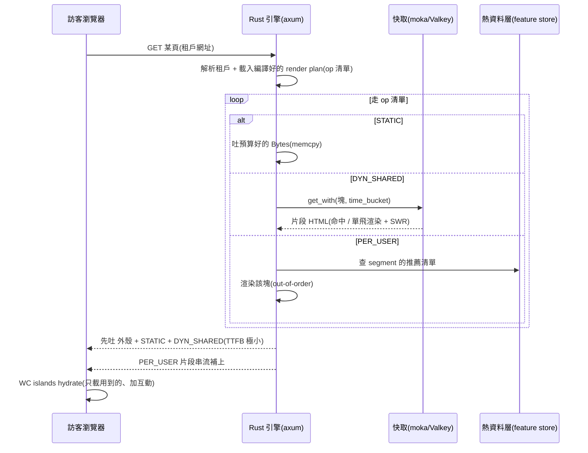
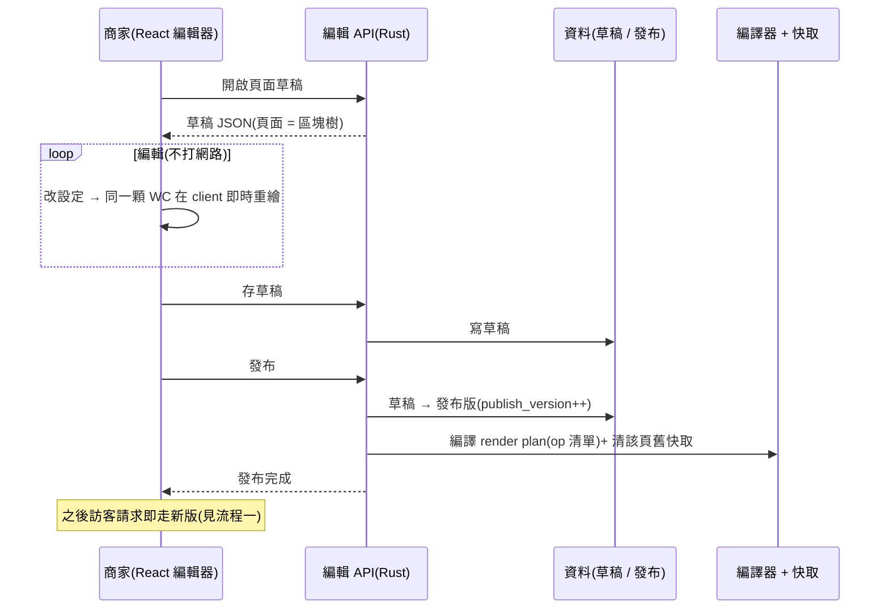
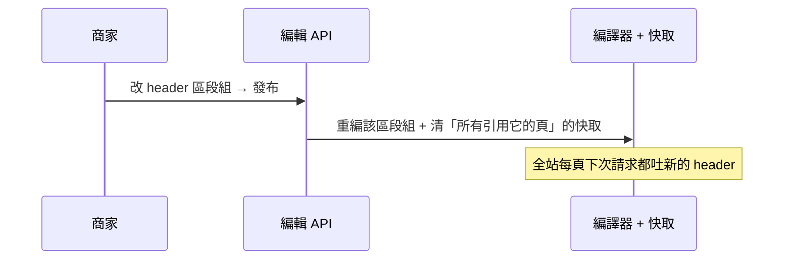

# 03 — 使用案例(時序圖)

> 技術視角:核心流程以**時序圖**表達(use case = 時序圖),由外而內。
> 先規劃、不實作。⚠️ 草擬,待 PO 核對。

## 流程一:訪客載入一頁(高 RPS 熱路徑)

> v1 全是 STATIC:上圖只走 STATIC 分支 + 快取吐 HTML;DYN_SHARED / PER_USER / 串流是 v2/v3 才亮的路。

## 流程二:商家編輯 → 發布

## 流程三:共用區段組(header/footer)發布

## 待補流程(後續版本)

- 資料型區塊接商品中心(商品清單 / 分類)——等商品中心就緒。
- 個人化區塊接推薦(feature store)——v3。
- 圖片資產上傳。
